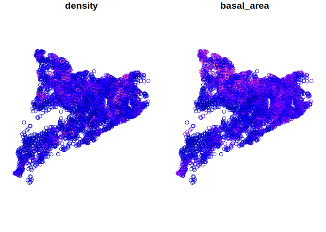
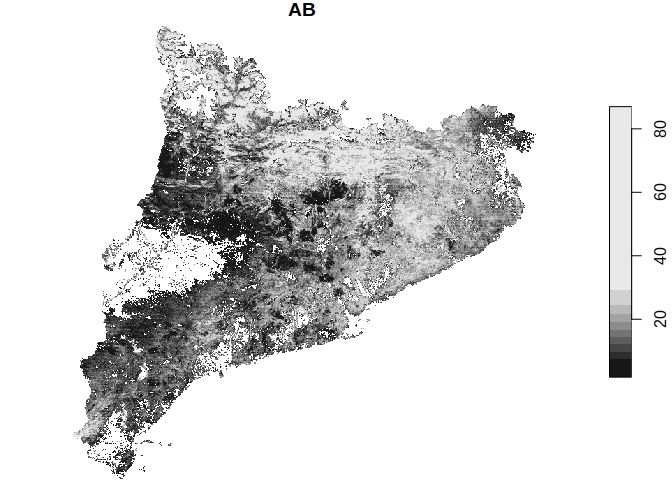

<!-- README.md is generated from README.Rmd. Please edit that file -->

# lfcdata

<!-- badges: start -->

[](https://travis-ci.org/MalditoBarbudo/lfcdata)
<!-- badges: end -->

The goal of `lfcdata` R package is to provide access to the [Laboratori
Forestal Català](http://laboratoriforestal.creaf.uab.cat/) public
databases.

## Installation

You can install the released version of lfcdata from
[GitHub](https://github.com/) with:

``` r
# install.packages("remotes")
remotes::install_github("MalditoBarbudo/lfcdata", ref = "master")
```

And the development version from [GitHub](https://github.com/) with:

``` r
# install.packages("remotes")
remotes::install_github("MalditoBarbudo/lfcdata", ref = "staging")
```

## Databases

### Spanish National Forest Inventory (NFI) data for Catalonia

``` r
library(lfcdata)
library(dplyr)
#> 
#> Attaching package: 'dplyr'
#> The following objects are masked from 'package:stats':
#> 
#>     filter, lag
#> The following objects are masked from 'package:base':
#> 
#>     intersect, setdiff, setequal, union
nfidb <- nfi()
nfidb
#>  Access to the Spanish National Forest Inventory data for Catalonia.
#>  laboratoriforestal.creaf.uab.cat
#> 
#>  Use nfi_get_data to access the tables.
#>  Use nfi_avail_tables to know which tables are available.
#>  Use nfi_describe_var to get the information available on the variables.
#>  See vignette('tables_and_variables', package = 'lfcdata') to learn more about the tables and variables.
nfidb %>%
  nfi_get_data('plot_nfi_4_results', spatial = TRUE) %>%
  select(geometry, density, basal_area) %>%
  plot()
```



### Allometries

``` r
allometriesdb <- allometries()
allometriesdb
#>  Access to the LFC allometries database.
#>  laboratoriforestal.creaf.uab.cat
#> 
#>  Use allometries_get_data to access the tables.
#>  Use allometries_calculate to calculate new values based on the allometries.
#>  Use allometries_describe_var to get the information available on the variables.
#>  See vignette('tables_and_variables', package = 'lfcdata') to learn more about the tables and variables.
allometriesdb %>%
  allometries_get_data('allometries')
#> # A tibble: 9,157 x 22
#>    allometry_id allometry_level allometry_level… spatial_level
#>  * <chr>        <chr>           <chr>            <chr>        
#>  1 BRH_1427     organ           branch           county       
#>  2 BH_287       organ           branch           county       
#>  3 Ht_3211      tree            tree             county       
#>  4 DC_2036      tree            tree             county       
#>  5 GC_2609      tree            tree             county       
#>  6 BH_288       organ           branch           county       
#>  7 BRH_1428     tree            tree             county       
#>  8 BH_289       tree            tree             county       
#>  9 Ht_3212      tree            tree             county       
#> 10 DC_2037      tree            tree             county       
#> # … with 9,147 more rows, and 18 more variables: spatial_level_name <chr>,
#> #   functional_group_level <chr>, functional_group_level_name <chr>,
#> #   dependent_var <chr>, independent_var_1 <chr>, independent_var_2 <chr>,
#> #   independent_var_3 <chr>, equation <chr>, param_a <dbl>, param_b <dbl>,
#> #   param_c <dbl>, param_d <dbl>, special_param <chr>,
#> #   cubication_shape <chr>, source <chr>, n_obs <dbl>, r_sqr <dbl>,
#> #   see <dbl>
```

### LiDAR eco-physiological data for Catalonia

``` r
lidardb <- lidar()
lidardb
#>  Access to the LiDAR rasters database.
#>  laboratoriforestal.creaf.uab.cat
#> 
#>  Use lidar_get_data to access the tables.
#>  Use lidar_avail_tables to know which tables are available.
#>  Use lidar_describe_var to get the information available on the variables.
#>  See vignette('tables_and_variables', package = 'lfcdata') to learn more about the tables and variables.
lidardb %>%
  lidar_get_data('AB', spatial = 'stars') %>%
  plot()
```


